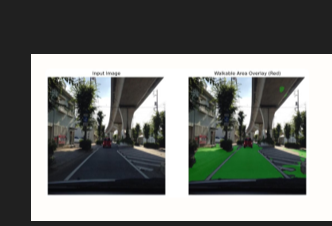
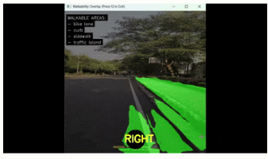
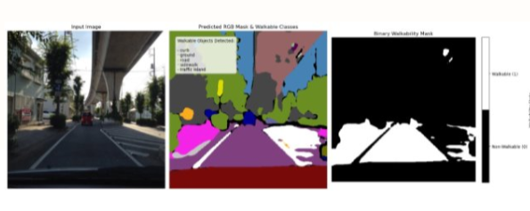

# 🚶 Walkable Area Path Segmentation & Navigation System

[](https://www.python.org/)
[](https://pytorch.org/)
[](https://pytorch.org/vision/stable/models.html)
[](https://www.mapillary.com/dataset/vistas)
[](LICENSE)

An end-to-end Computer Vision & Deep Learning system for **Walkable Path Detection and Real-Time Urban Navigation**. Built using **DeepLabV3 with a ResNet-50 backbone** trained on the **Mapillary Vistas dataset** (124 semantic classes), this system segments complex street scenes, dynamically maps class predictions to walkability scores, generates binary walkability heatmaps, overlays walkable path boundaries in real-time, and assists autonomous robots or visually-impaired individuals.

---

## 📸 Output & Model Implementation

### 1. Real-Time Overlay & Navigation Visualizer
Input street scenes are processed to generate green path overlays identifying walkable terrain, along with real-time text indicators listing detected walkable objects (e.g., `curb`, `sidewalk`, `crosswalk`) and navigation status indicators.

| Input Image & Walkable Overlay | Real-Time Navigation Overlay Window |
| :---: | :---: |
|  |  |
> *Note: Place your output screenshots in `assets/input_vs_overlay.png` and `assets/realtime_navigation.png` to render them above.*

### 2. Multi-Stage Segmentation Pipeline
The model processes input imagery through a 3-stage visual pipeline:



1. **Input RGB Image**: Raw camera image captured in complex street environments.
2. **Predicted RGB Semantic Mask**: Pixel-level multi-class semantic segmentation identifying 124 urban scene classes (curb, ground, road, sidewalk, traffic island, vehicles, vegetation, etc.).
3. **Binary Walkability Mask**: Converts the semantic mask into a binary map using custom walkability rules (**White = Walkable (1.0)**, **Black = Non-Walkable (0.0)**).

> **💡 Key Insight**: Walkability mapping is **fully dynamic**. You can adjust which classes are considered walkable in `walkability_meta.json` at any time, and the system adapts instantly **without requiring model retraining**.

---

## 📥 Model Weights & Download Links

Due to GitHub's **100 MB single file size limit**, the pre-trained PyTorch weight file `deeplabv3_resnet50_trained.pth` (~168.5 MB) is hosted externally.

| Resource | Description | Size | Download Link |
| :--- | :--- | :--- | :--- |
| **DeepLabV3 Model Checkpoint** | Fine-tuned PyTorch weight (`deeplabv3_resnet50_trained.pth`) | ~168.5 MB | 🔗 **[Click Here to Download Model Weight](YOUR_DOWNLOAD_LINK_HERE)** |
| **Mapillary Vistas Dataset** | Official street scene segmentation dataset | Varies | 🔗 **[Mapillary Vistas Official Site](https://www.mapillary.com/dataset/vistas)** |

> **Setup Note**: Download `deeplabv3_resnet50_trained.pth` from the link above and place it in the `mapillary-vistas/` directory:
> ```text
> mapillary-vistas/deeplabv3_resnet50_trained.pth
> ```

---

## 📌 Key Features

- **DeepLabV3 + ResNet-50 Architecture**: Atrous Spatial Pyramid Pooling (ASPP) extracts multi-scale contextual features for high-resolution semantic segmentation.
- **124-Class Compact Remapping**: Maps Mapillary Vistas class IDs to compact indices (0–123) for fast GPU tensor calculation.
- **Dynamic Walkability Taxonomy**: Uses `walkability_meta.json` to assign score $1.0$ to walkable terrain (sidewalks, crosswalks, footways, curb cuts, driveways) and $0.0$ to obstacles.
- **Textual Walkable Feature Logging**: Automatically exports detected walkable objects to a text file (e.g., `walkable_objects_output.txt`).
- **Real-Time Video & Photo Inference**: Compatible with static photos and continuous video streams (`.mp4`).

---

## 🛠️ Repository Structure

```text
.
├── assets/                     # Place your output screenshot images here (.png / .jpg)
│   ├── input_vs_overlay.png
│   ├── realtime_navigation.png
│   └── output_pipeline.png
├── mapillary-vistas/
│   ├── meta.json               # Mapillary Vistas 124-class metadata
│   ├── walkability_meta.json   # Dynamic walkability scores per class ID
│   ├── LICENSE.md              # Dataset license
│   └── README.md
├── model.ipynb                 # Training notebook: DataLoaders, model training & weight saving
├── usage.ipynb                 # Inference notebook: Mask prediction, heatmap generation & text log
├── output.ipynb                # Visualization notebook: RGB overlays & walkability masks
├── .gitignore                  # Git rules (excludes heavy weights, datasets, real/ & rvids/)
└── README.md                   # Project documentation
```

---

## 💻 How to Run This Model on Your PC

Follow this step-by-step guide to run training or inference on your local machine:

### Step 1: Clone the Repository
Open Terminal or Command Prompt and run:
```bash
git clone https://github.com/YOUR_USERNAME/YOUR_REPOSITORY_NAME.git
cd YOUR_REPOSITORY_NAME
```

### Step 2: Set Up Python Environment
Recommended Python version: **3.8, 3.9, 3.10, or 3.11**.

```bash
# Windows (Command Prompt / PowerShell)
python -m venv venv
venv\Scripts\activate

# macOS / Linux
python3 -m venv venv
source venv/bin/activate
```

### Step 3: Install Required Dependencies
Install PyTorch (with CUDA support if you have an NVIDIA GPU) and computer vision packages:

```bash
# Install PyTorch (CUDA 11.8 / GPU enabled)
pip install torch torchvision --extra-index-url https://download.pytorch.org/whl/cu118

# Or for CPU-only:
# pip install torch torchvision

# Install required helper packages
pip install numpy pillow matplotlib opencv-python tqdm jupyter
```

### Step 4: Add the Model Weights
1. Download `deeplabv3_resnet50_trained.pth` from the [Download Link](YOUR_DOWNLOAD_LINK_HERE).
2. Move/copy `deeplabv3_resnet50_trained.pth` inside the `mapillary-vistas/` folder:
   ```text
   YOUR_REPOSITORY_NAME/mapillary-vistas/deeplabv3_resnet50_trained.pth
   ```

### Step 5: Launch Jupyter Notebooks
Start Jupyter Notebook:
```bash
jupyter notebook
```

- **To run Inference on your images/videos**: Open `usage.ipynb` and run all cells.
- **To view Visual Overlays & Masks**: Open `output.ipynb` and run all cells.
- **To Train/Fine-Tune the Model**: Open `model.ipynb` and run all cells (requires GPU for faster training).

---

## 🖼️ How to Add Your Output Screenshots

1. Save your output screenshots inside the `assets/` folder in your project root:
   - `assets/input_vs_overlay.png`
   - `assets/realtime_navigation.png`
   - `assets/output_pipeline.png`
2. Commit and push the `assets/` folder to GitHub:
   ```bash
   git add assets/
   git commit -m "Add output screenshot images"
   git push
   ```
3. GitHub will automatically display your images in the `README.md`!

---

## 📤 Commands for Adding & Pushing to GitHub

```bash
# 1. Add modified files
git add .

# 2. Commit changes
git commit -m "Update README with model details, output images & setup guide"

# 3. Add remote repository (replace with your GitHub URL)
git remote add origin https://github.com/YOUR_USERNAME/YOUR_REPOSITORY_NAME.git

# 4. Push to GitHub
git branch -M main
git push -u origin main
```

---

## 📜 License

This project is licensed under the MIT License - see the [LICENSE](LICENSE) file for details.
